<p align="center">
  
</p>

<h1 align="center">Crash Predict AI</h1>

<p align="center">
  <strong>RAG-Powered Crash Game Prediction Engine</strong><br/>
  <em>Real-time WebSocket interception + Local Vector DB + Gemini 2.5 Flash LLM</em>
</p>

<p align="center">
  
  
  
  
  
  
</p>

> **WARNING: This project is strictly for educational and research purposes. It interacts with real-money gambling platforms. See the [Disclaimer](#-disclaimer--responsible-gambling) section before use.**

---

## Table of Contents

- [Overview](#-overview)
- [Key Features](#-key-features)
- [System Architecture](#-system-architecture)
- [How It Works — The RAG Pipeline](#-how-it-works--the-rag-pipeline)
  - [Stage 1: WebSocket Interception](#stage-1-websocket-interception)
  - [Stage 2: Feature Extraction (9D Vector)](#stage-2-feature-extraction-9d-vector)
  - [Stage 3: Vector Storage (IndexedDB)](#stage-3-vector-storage-indexeddb)
  - [Stage 4: KNN Similarity Retrieval](#stage-4-knn-similarity-retrieval)
  - [Stage 5: LLM Generation (Gemini 2.5 Flash)](#stage-5-llm-generation-gemini-25-flash)
  - [Stage 6: Reinforcement Feedback Loop](#stage-6-reinforcement-feedback-loop)
- [Technical Deep Dive](#-technical-deep-dive)
- [Installation & Setup](#-installation--setup)
- [Configuration Reference](#-configuration-reference)
- [UI Components](#-ui-components)
- [API Reference](#-api-reference)
- [Performance Characteristics](#-performance-characteristics)
- [Design Decisions](#-design-decisions)
- [Disclaimer & Responsible Gambling](#-disclaimer--responsible-gambling)
- [License](#-license)

---

## Overview

Crash Predict AI is a **single-file, zero-dependency** browser userscript (~1,250 lines of vanilla JavaScript) that implements a complete **Retrieval-Augmented Generation (RAG)** pipeline — entirely client-side. It intercepts live crash game data via WebSocket hooks, builds a persistent local vector database in IndexedDB, performs KNN similarity search with learned reward weighting, and feeds retrieved context to Google's Gemini 2.5 Flash LLM for real-time crash multiplier predictions.

### What Makes This Unique

| Aspect | Traditional Approach | This Project |
|:---|:---|:---|
| **Data Storage** | Cloud database / external API | Browser-native IndexedDB |
| **Vector Search** | Pinecone, Weaviate, FAISS | Custom KNN with cosine similarity |
| **Embeddings** | OpenAI / Sentence Transformers | Hand-crafted 9D feature vectors |
| **LLM** | GPT-4, Claude, etc. | Gemini 2.5 Flash (free tier) |
| **Infrastructure** | Server + DB + API Gateway | Zero — runs entirely in-browser |
| **Dependencies** | npm packages, Python libs | None — pure vanilla JavaScript |

---

## Key Features

```mermaid
graph LR
    subgraph Capture ["Real-Time Capture"]
        A1[WebSocket/SignalR Hook]
        A2[Automatic Event Parsing]
        A3[Zero-Latency Intercept]
        A4[Works on Page Load]
    end

    subgraph Storage ["Intelligent Storage"]
        B1[IndexedDB Vector Store]
        B2[9D Feature Vectors]
        B3[Min-Max Normalization]
        B4[Persistent Across Tabs]
    end

    subgraph Prediction ["AI Prediction"]
        C1[Gemini 2.5 Flash LLM]
        C2[Dynamic Temperature]
        C3[Adaptive K Neighbors]
        C4[Confidence Scoring]
    end

    subgraph Search ["Similarity Search"]
        D1[Cosine Similarity KNN]
        D2[Reward-Weighted Scoring]
        D3[Exponential Time Decay]
        D4[Adaptive Threshold 0.85]
    end

    subgraph Learning ["Feedback Learning"]
        E1[Reward/Punish Vectors]
        E2[Accuracy Tracking]
        E3["Score Clamping [0.1, 100]"]
        E4[Auto-Learning Per Round]
    end

    subgraph UI ["Rich UI"]
        F1[Draggable Floating Panel]
        F2[Live Multiplier Display]
        F3[Prediction Confidence Bar]
        F4[Data Export/Import]
    end

    Capture --> Storage --> Search --> Prediction --> UI --> Learning
    Learning -.->|Updates Vectors| Storage
```

---

## System Architecture

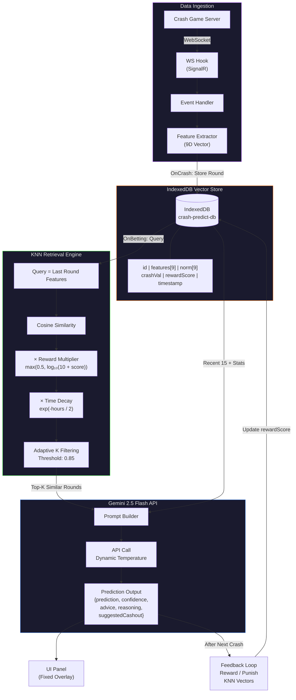

---

## How It Works — The RAG Pipeline

The system operates as a **6-stage pipeline** that runs automatically on every game round:

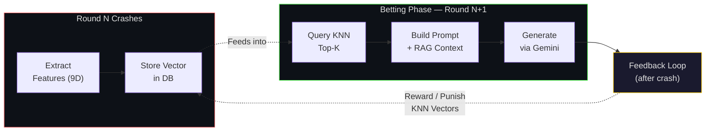

### Stage 1: WebSocket Interception

The script intercepts WebSocket connections by overriding the global `WebSocket` constructor. It targets connections containing `sockets/crash` in the URL and hooks into SignalR message traffic.

**Intercepted Events:**

| Event | Phase | Purpose |
|:---|:---|:---|
| `OnRegistration` | Init | Loads game config (`gainCoef`), past history, initializes DB |
| `OnStage` | Reset | Resets per-round counters, clears tick data |
| `OnBetting` | Pre-round | **Triggers AI prediction** — the RAG pipeline starts here |
| `OnStart` | Live | Starts multiplier animation, records `coeffStartTime` |
| `OnProfits` | Live | Tracks profit tick events, computes inter-tick deltas |
| `OnCashouts` | Live | Counts cashout events for ratio calculation |
| `OnCrash` | End | Stores round vector, evaluates prediction, updates rewards |

**SignalR Message Format:**

```
Messages are separated by \x1e (Record Separator)
Each message: { "type": 1, "target": "EventName", "arguments": [data] }
```

### Stage 2: Feature Extraction (9D Vector)

Each completed round is transformed into a **9-dimensional feature vector** capturing the round's behavioral fingerprint:

| Dim | Feature | Formula | Range | What It Captures |
|:---:|:---|:---|:---|:---|
| `f0` | Crash Value (log) | `ln(max(crashValue, 1))` | 0 — 3.6 | Magnitude of the crash on log scale |
| `f1` | Avg Delta | `mean(profitDeltas)` | 0 — 2000ms | Average tick spacing |
| `f2` | Min Delta | `min(profitDeltas)` | 0 — 1000ms | Fastest tick observed |
| `f3` | Std Delta | `stddev(profitDeltas)` | 0 — 800ms | Tick timing consistency |
| `f4` | Cashout Ratio | `cashouts / (cashouts + profits)` | 0 — 1 | Player behavior signal |
| `f5` | Round Duration | `crashTime - startTime` | 0 — 60000ms | How long the round lasted |
| `f6` | Low Streak | consecutive rounds < 1.5x | 0 — 10 | Current cold streak depth |
| `f7` | High Streak | consecutive rounds > 5.0x | 0 — 10 | Current hot streak depth |
| `f8` | Tick Leak | `delta ≤ 5ms ? 1 : 0` | 0 or 1 | Suspiciously fast tick detected |

**Feature Importance Intuition:**

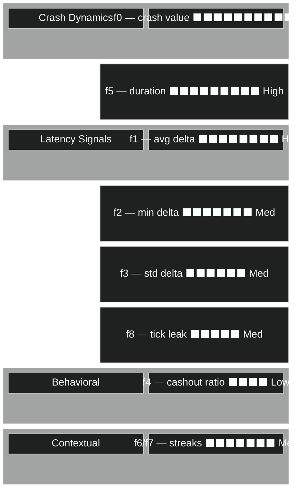

### Stage 3: Vector Storage (IndexedDB)

All feature vectors are persisted in an **IndexedDB object store** — acting as a lightweight, browser-native vector database.

**Database Schema:**

```
Database: crash-predict-db (v1)
Store:    rounds (autoIncrement, keyPath: "id")
Index:    ts (non-unique)
```

**Record Structure:**

| Field | Type | Description |
|:---|:---|:---|
| `id` | `number` | Auto-increment primary key |
| `cv` | `number` | Raw crash value (e.g., `2.45`) |
| `features` | `number[9]` | Raw 9D feature vector |
| `norm` | `number[9]` | Normalized features (min-max scaled to 0-1) |
| `lowStreak` | `number` | Consecutive low crashes at time of round |
| `highStreak` | `number` | Consecutive high crashes at time of round |
| `avgDelta` | `number` | Average profit tick delta (ms) |
| `minDelta` | `number` | Minimum profit tick delta (ms) |
| `tickLeak` | `boolean` | Whether a suspiciously fast tick was detected |
| `duration` | `number` | Round duration in milliseconds |
| `profitCount` | `number` | Number of profit events |
| `cashoutCount` | `number` | Number of cashout events |
| `rewardScore` | `number` | Learned quality score (default: 1.0, range: 0.1-100) |
| `ts` | `number` | Unix timestamp when stored |

**Normalization Ranges:**

Each feature dimension is scaled to `[0, 1]` using fixed min-max ranges:

| Dimension | Min | Max | Unit |
|:---|:---:|:---:|:---|
| `f0` ln(crash) | 0.0 | 3.6 | — |
| `f1` avgDelta | 0 | 2,000 | ms |
| `f2` minDelta | 0 | 1,000 | ms |
| `f3` stdDelta | 0 | 800 | ms |
| `f4` cashoutRatio | 0.0 | 1.0 | ratio |
| `f5` duration | 0 | 60,000 | ms |
| `f6` lowStreak | 0 | 10 | count |
| `f7` highStreak | 0 | 10 | count |
| `f8` tickLeak | 0 | 1 | binary |

### Stage 4: KNN Similarity Retrieval

When a new betting phase begins, the system retrieves the most similar historical rounds using a **weighted KNN algorithm**.

**Similarity Scoring Formula:**

```
finalScore = cosineSimilarity(queryNorm, candidateNorm)
             × rewardMultiplier
             × timeDecay
```

Where:

| Component | Formula | Purpose |
|:---|:---|:---|
| **Cosine Similarity** | `dot(a,b) / (‖a‖ × ‖b‖)` | Core geometric similarity in 9D space |
| **Reward Multiplier** | `max(0.5, log₁₀(10 + rewardScore))` | Boost well-performing vectors, suppress bad ones |
| **Time Decay** | `exp(-hoursOld / 2)` | Exponential decay with ~2-hour half-life |

**Adaptive K Filtering:**

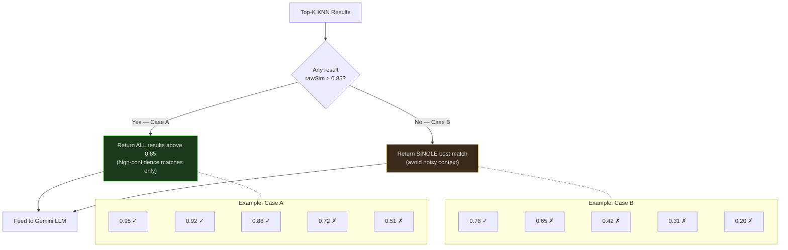

This prevents noisy low-similarity results from confusing the LLM.

### Stage 5: LLM Generation (Gemini 2.5 Flash)

The retrieved KNN context augments a structured prompt sent to Gemini 2.5 Flash via the Google Generative AI REST API.

**Prompt Structure:**

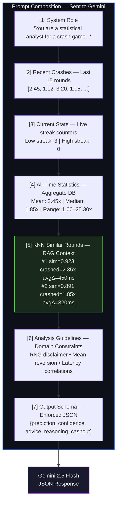

**Dynamic Temperature Scaling:**

The LLM temperature adapts to recent crash volatility:

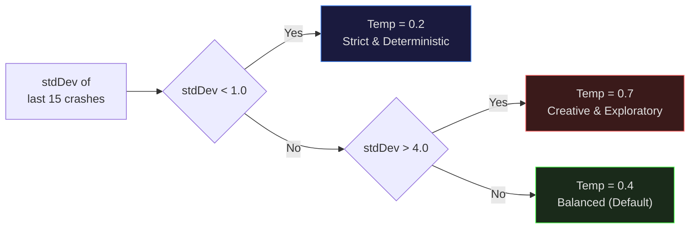

**API Configuration:**

| Parameter | Value |
|:---|:---|
| Endpoint | `generativelanguage.googleapis.com/v1beta/models/{model}:generateContent` |
| Model | `gemini-2.5-flash` (configurable) |
| Response Format | `application/json` (structured output) |
| Max Tokens | 512 |
| Thinking Mode | Disabled (`thinkingBudget: 0`) |

**Response Format:**

```json
{
  "prediction": 2.45,
  "confidence": 68,
  "advice": "BET",
  "reasoning": "After 3 consecutive low crashes, mean reversion likely...",
  "suggestedCashout": 1.85
}
```

| Field | Type | Range | Description |
|:---|:---|:---|:---|
| `prediction` | `number` | 1.0 — 35.0 | Predicted crash multiplier |
| `confidence` | `number` | 0 — 100 | Model's self-assessed confidence (%) |
| `advice` | `string` | `BET` / `SKIP` / `CAUTION` | Actionable recommendation |
| `reasoning` | `string` | — | One-line explanation |
| `suggestedCashout` | `number` | — | Conservative auto-cashout target |

### Stage 6: Reinforcement Feedback Loop

After each crash, the system evaluates the previous prediction and **adjusts the reward scores** of the KNN vectors that contributed to it. This creates a self-improving retrieval system.

**Reward/Penalty Matrix:**

| Scenario | Multiplier | Effect |
|:---|:---:|:---|
| Missed instant 1.00x crash | `×0.60` | HUGE penalty |
| Predicted higher than actual (busted) | `×0.80` | Heavy penalty |
| Gap > 1.0 (predicted way too low) | `×0.60` | HUGE penalty |
| Gap ≤ 0.8 (fair prediction) | `×1.02` | Small reward |
| Gap ≤ 0.4 (good prediction) | `×1.05` | Medium reward |
| Gap ≤ 0.2 (excellent prediction) | `×1.10` | High reward |

**Reward Score Dynamics:**

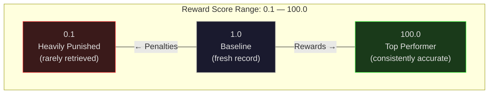

**Accuracy Tracking Rules:**

| Advice Given | Outcome | Counted As |
|:---|:---|:---|
| `SKIP` | Actual crash < 1.5x | Correct |
| `BET` | Actual crash >= suggestedCashout | Correct |
| `CAUTION` | Actual crash >= 1.3x | Correct |
| `WAIT` / `ERROR` | Any | Not tracked |

---

## Technical Deep Dive

### WebSocket Hook Mechanism

The script overrides `window.WebSocket` at `document-start` to ensure it captures connections before the game initializes:

```javascript
// Override constructor — intercepts all new WebSocket connections
window.WebSocket = function(url, protocols) {
    const ws = protocols ? new OrigWS(url, protocols) : new OrigWS(url);
    if (url.includes("sockets/crash"))
        ws.addEventListener("open", () => hookSocket(ws, "constructor"));
    return ws;
};

// Preserve prototype chain and static constants
window.WebSocket.prototype = OrigWS.prototype;
window.WebSocket.CONNECTING = OrigWS.CONNECTING;
window.WebSocket.OPEN = OrigWS.OPEN;
window.WebSocket.CLOSING = OrigWS.CLOSING;
window.WebSocket.CLOSED = OrigWS.CLOSED;
```

### Cosine Similarity Implementation

```javascript
cosine(a, b) {
    let dot = 0, ma = 0, mb = 0;
    for (let i = 0; i < a.length; i++) {
        dot += a[i] * b[i];
        ma  += a[i] * a[i];
        mb  += b[i] * b[i];
    }
    ma = Math.sqrt(ma);
    mb = Math.sqrt(mb);
    return (ma && mb) ? dot / (ma * mb) : 0;
}
```

### Multiplier Calculation

The multiplier curve follows a **quadratic function** derived from the game's `gainCoef`:

```
multiplier(t) = min((gainCoef / 10⁹) × t² + 1, 35)

where t = elapsed time in milliseconds
      gainCoef = server-provided coefficient (default: 25)
      max cap = 35x
```

### Gemini Response Parsing

Gemini 2.5 Flash is a "thinking" model. The parser handles multiple edge cases:

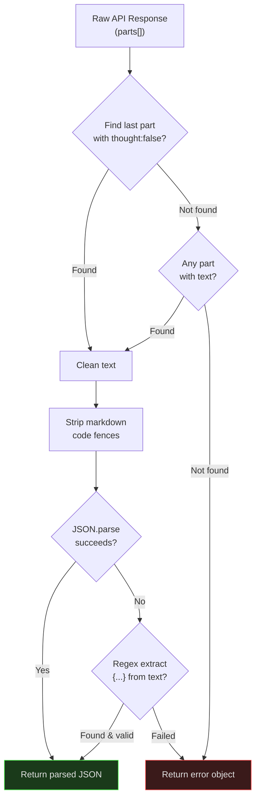

---

## Installation & Setup

### Prerequisites

| Requirement | Details |
|:---|:---|
| **Browser** | Chrome, Edge, Firefox, or Safari (modern versions) |
| **Extension** | [Tampermonkey](https://www.tampermonkey.net/) or [Violentmonkey](https://violentmonkey.github.io/) |
| **API Key** | Free Gemini API key from [Google AI Studio](https://aistudio.google.com/app/apikey) |

### Step-by-Step Installation

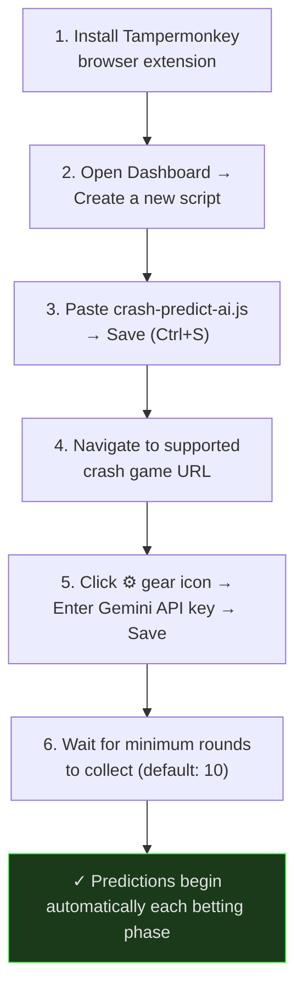

### Supported URLs

```
https://melbet-srilanka.com/games-frame/games/371*
https://*.melbet*.com/games-frame/games/371*
```

---

## Configuration Reference

All settings persist in `localStorage` and can be changed via the in-app config modal (gear icon):

| Setting | Key | Default | Range | Description |
|:---|:---|:---|:---|:---|
| API Key | `cp_api_key` | — | — | Google Gemini API key |
| Model | `cp_model` | `gemini-2.5-flash` | — | Gemini model identifier |
| KNN K | `cp_knn_k` | `5` | 1-20 | Number of similar rounds to retrieve |
| Min Rounds | `cp_min_rounds` | `10` | 3-100 | Minimum stored rounds before predictions begin |
| Auto Predict | `cp_auto` | `true` | — | Trigger prediction automatically on betting phase |

### Internal Constants

| Constant | Value | Purpose |
|:---|:---|:---|
| `STREAK_LOW` | 1.5x | Threshold for "low crash" streak counting |
| `STREAK_HIGH` | 5.0x | Threshold for "high crash" streak counting |
| `P1_DELTA` | 5ms | Tick leak detection threshold |
| `DB_NAME` | `crash-predict-db` | IndexedDB database name |
| `DB_VER` | 1 | Database version |

---

## UI Components

The UI is a **fixed-position draggable overlay** with the following sections:

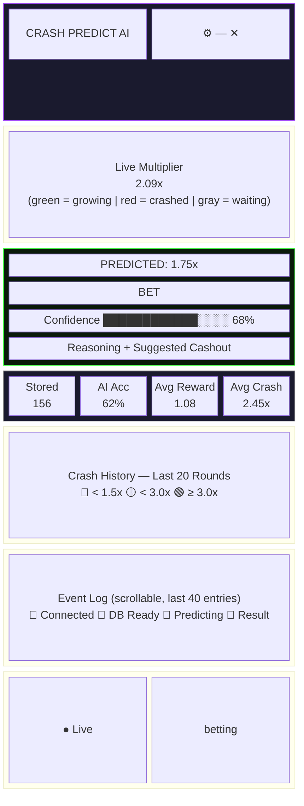

**Advice Color Coding:**

| Advice | Box Color | Text Color | Meaning |
|:---|:---|:---|:---|
| `BET` | Green glow | `#4cff4c` | Model suggests betting this round |
| `SKIP` | Red glow | `#ff4444` | Model suggests skipping |
| `CAUTION` | Yellow glow | `#ffc800` | Uncertain — proceed carefully |
| `WAIT` | Gray | `#666666` | Insufficient data |
| `ERROR` | Red border | `#ff4444` | API or parse error |

---

## API Reference

### Debug Console

```javascript
// Returns full internal state snapshot
const state = await window.__predict_debug();
// → { config, dbStats, recentRounds, aiState, gameState }
```

### Destroy Script

```javascript
// Removes UI, unhooks WebSocket, stops animations
window.__predict_destroy();
```

### Data Management (via Config Modal)

| Action | Description |
|:---|:---|
| **Export** | Downloads all stored rounds as timestamped JSON file |
| **Import** | Loads rounds from JSON file (replaces existing data) |
| **Clear** | Deletes all stored crash data (irreversible) |

---

## Performance Characteristics

| Operation | Complexity | Typical Latency |
|:---|:---|:---|
| Feature extraction | O(d) where d = profit events | < 1ms |
| Vector normalization | O(9) | < 0.1ms |
| KNN search (full scan) | O(n) where n = stored rounds | ~5ms for 1000 rounds |
| Gemini API call | Network-bound | 500ms — 3s |
| IndexedDB write | O(1) | < 5ms |
| UI update | O(1) | < 1ms |

**Memory Footprint:**

| Scale | Size | Notes |
|:---|:---|:---|
| Per stored round | ~500 bytes | features + metadata |
| 1,000 rounds | ~500 KB | — |
| 10,000 rounds | ~5 MB | — |
| IndexedDB limit | Browser-dependent | Typically 50-80% of available disk |

---

## Design Decisions

### Why Local Vector DB Instead of Cloud?

| Factor | Local (IndexedDB) | Cloud (Pinecone/Weaviate) |
|:---|:---|:---|
| Privacy | Data never leaves browser | Requires data upload |
| Latency | < 5ms queries | 50-200ms network RTT |
| Cost | Free | Paid tiers for persistence |
| Setup | Zero config | API keys, provisioning |
| Offline | Works offline (except LLM) | Requires internet |
| Persistence | Survives page refresh | Always available |

### Why Hand-Crafted Features Instead of Embeddings?

- **Domain specificity**: 9 carefully chosen dimensions capture exactly what matters for crash prediction
- **Interpretability**: Each dimension has clear meaning (vs. 768-dim opaque embeddings)
- **Efficiency**: 9D cosine similarity is trivially fast
- **No embedding model needed**: Zero additional API calls or model loading

### Why KNN + LLM Hybrid Instead of LLM-Only?

| Capability | LLM-Only | KNN-Only | KNN + LLM (This Project) |
|:---|:---:|:---:|:---:|
| Grounded in real data | No | Yes | **Yes** |
| Can reason & explain | Yes | No | **Yes** |
| Low hallucination risk | No | Yes | **Yes** |
| Historical context | No | Yes | **Yes** |
| Flexible reasoning | Yes | No | **Yes** |
| Fast & deterministic | No | Yes | **Yes** (KNN) + LLM |

### Why Exponential Time Decay?

| Hours Old | Decay Factor | Effective Weight |
|:---:|:---:|:---|
| 0 | 1.000 | `████████████████████` 100% |
| 1 | 0.607 | `████████████` 61% |
| 2 | 0.368 | `███████` 37% |
| 4 | 0.135 | `███` 14% |
| 8 | 0.018 | `▓` 2% |
| 12 | 0.002 | `░` 0.2% |

Recent rounds reflect current game server dynamics. Data older than ~6 hours has minimal influence, preventing stale patterns from dominating predictions.

---

## Disclaimer & Responsible Gambling

> **THIS TOOL IS FOR EDUCATIONAL AND RESEARCH PURPOSES ONLY**

### Financial Risk

- This tool interacts with **real-money gambling platforms**
- Using this script may result in **complete loss of deposited funds**
- No prediction system can guarantee profits in a provably fair RNG game

### No Guarantees

- **Past performance does not predict future results**
- Crash games use **provably fair RNG** — no deterministic pattern exists
- This script provides statistical analysis, not financial advice
- **Cannot reliably predict outcomes** — any appearance of accuracy is coincidental clustering

### User Responsibility

- **Use entirely at your own risk**
- Authors assume **zero responsibility** for any financial losses
- This tool should **never** be the sole basis for financial decisions
- Do **not** invest money you cannot afford to lose

### Legal Considerations

- Ensure automated prediction tools are **legal in your jurisdiction**
- Many jurisdictions **prohibit** such tools — check local laws
- Review the platform's **Terms of Service** before use
- Violation may result in account suspension or legal action

### Responsible Gambling Resources

If you or someone you know has a gambling problem:

| Resource | Contact |
|:---|:---|
| **Gamblers Anonymous** | [www.gamblersanonymous.org](https://www.gamblersanonymous.org) |
| **National Council on Problem Gambling** | 1-800-522-4700 |
| **GamCare** | [www.gamcare.org.uk](https://www.gamcare.org.uk) |
| **BeGambleAware** | [www.begambleaware.org](https://www.begambleaware.org) |

---

## License

This project is licensed under the **MIT License** with additional restrictions — **Personal Use Only, No Commercial Use**.

See the full [LICENSE](LICENSE) file for complete terms.

---

<p align="center">
  <sub>Built with vanilla JavaScript. No frameworks. No dependencies. No backend.</sub>
</p>
