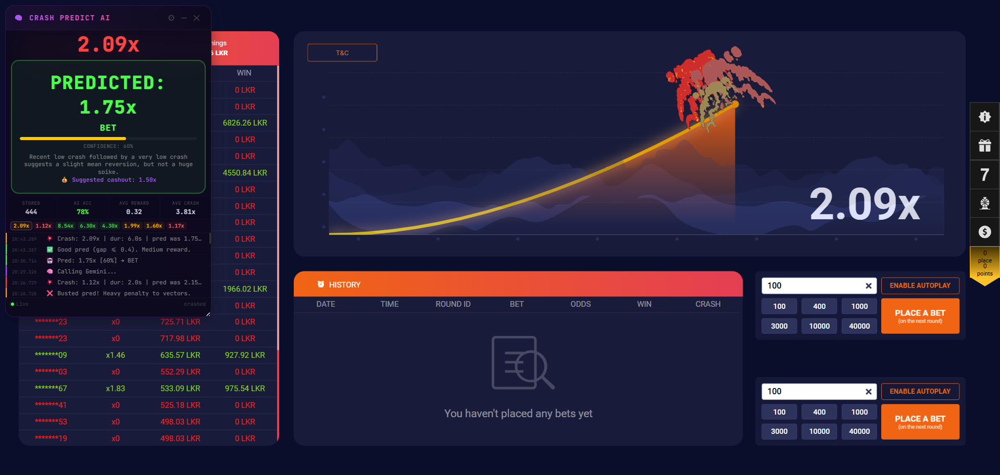

# Crash Predict AI - Powered by Gemini



> **⚠️ EDUCATIONAL PURPOSES ONLY — SEE DISCLAIMER SECTION**

---

## 1. Overview

Crash Predict AI is a browser-based userscript (Tampermonkey/Violentmonkey) that implements a retrieval-augmented generation (RAG) system for crash game predictions. It combines local vector database storage with Gemini 2.5 Flash LLM to generate intelligent predictions based on historical game patterns.

### Supported Platforms

- `https://melbet-srilanka.com/games-frame/games/371*`
- `https://*.melbet*.com/games-frame/games/371*`

---

## 2. What Is The Problem?

Crash games are gambling games where a multiplier rises from 1.00x and randomly "crashes." Players must cash out before the crash occurs. The challenge is that:

- **Randomness**: These games use provably fair RNG — no deterministic pattern exists
- **Real Money Risk**: Players risk real funds on each bet
- **Information Gap**: Players make decisions with limited historical context

---

## 3. How The Solution Works

The system works in six sequential stages:

### Stage 1: Data Collection

The script hooks into WebSocket/SignalR traffic to intercept game events:

1. **Message Parsing**: Splits on `\x1e` (SignalR record separator), parses JSON
2. **Event Types**:
   - `OnRegistration`: Initializes game state
   - `OnStage`: New round starts
   - `OnBetting`: Betting phase begins
   - `OnStart`: Round goes live (multiplier rising)
   - `OnProfits`: Tracks profit events and calculates deltas
   - `OnCashouts`: Tracks cashout events
   - `OnCrash`: Round ends

### Stage 2: Feature Extraction

Each round produces a 9-dimensional feature vector:

| Feature          | Index | Description                             |
| ---------------- | ----- | --------------------------------------- |
| `ln(crashValue)` | f0    | Log-scale crash value                   |
| `avgDelta`       | f1    | Average time between profit events (ms) |
| `minDelta`       | f2    | Minimum time delta (ms)                 |
| `stdDelta`       | f3    | Standard deviation of deltas            |
| `cashoutRatio`   | f4    | Cashouts / total events                 |
| `roundDuration`  | f5    | Total round time (ms)                   |
| `lowStreak`      | f6    | Consecutive <1.5x crashes               |
| `highStreak`     | f7    | Consecutive >5.0x crashes               |
| `tickLeak`       | f8    | Rapid tick detection (binary)           |

### Stage 3: Data Storage

Features are stored in IndexedDB with normalization (0-1 scaling):

```
DB Name: crash-predict-db
Store: rounds
```

Each record includes:

- Raw features, normalized features
- Crash value, timestamps
- Reward score (learned from past predictions)

### Stage 4: Retrieval (KNN)

Before each prediction, the system:

1. Takes the **last round's features** as query vector
2. Computes **cosine similarity** against all stored vectors
3. Applies **reward weighting** (learned accuracy)
4. Applies **time decay** (2-hour half-life)
5. Returns top-K similar rounds (default: 5)

**Scoring Formula:**

```
finalScore = rawSimilarity × rewardMultiplier × timeDecay
```

### Stage 5: Generation (LLM)

The retrieved context augments a prompt sent to Gemini 2.5 Flash:

```
You are a statistical analyst for a crash/multiplier game...

RECENT CRASHES: [2.45, 1.12, 3.20, 1.05, ...]

CURRENT STATE:
- Consecutive low crashes (<1.5x): 3
- Consecutive high crashes (>5.0x): 0

ALL-TIME STATISTICS (156 rounds):
- Mean: 2.45x | Median: 1.85x
- Range: 1.00x – 25.30x

5 MOST SIMILAR ROUNDS:
#1 [sim=0.923] crashed=2.35x | avgΔ=450ms | ...
...

ANALYSIS GUIDELINES:
- The game uses provably fair RNG — no deterministic pattern
- Mean reversion tendencies are observable
- Latency features correlate with crash timing

Return ONLY valid JSON...
```

**Model Configuration:**

- Model: `gemini-2.5-flash`
- Temperature: 0.2-0.7 (dynamic based on volatility)
- Thinking: Disabled for clean JSON output

**Response Format:**

```json
{
  "prediction": 2.45,
  "confidence": 68,
  "advice": "BET",
  "reasoning": "After 3 consecutive low crashes, mean reversion...",
  "suggestedCashout": 1.85
}
```

### Stage 6: Feedback Loop

After each crash, predictions are evaluated:

| Scenario                     | Multiplier    |
| ---------------------------- | ------------- |
| Missed 1.00x instant crash   | 0.60 (punish) |
| Predicted higher than actual | 0.80 (punish) |
| Gap >1.0 (predicted too low) | 0.60 (punish) |
| Gap ≤0.2 (excellent)         | 1.10 (reward) |
| Gap ≤0.4 (good)              | 1.05 (reward) |
| Gap ≤0.8 (fair)              | 1.02 (reward) |

---

## 4. Component Details

### 4.1 Vector Database (IndexedDB)

**Schema:**

| Field          | Description                           |
| -------------- | ------------------------------------- |
| `id`           | Auto-increment primary key            |
| `crashValue`   | Actual crash multiplier               |
| `features`     | 9D raw feature vector                 |
| `norm`         | Normalized feature vector             |
| `lowStreak`    | Consecutive low crashes before round  |
| `highStreak`   | Consecutive high crashes before round |
| `avgDelta`     | Average time delta (ms)               |
| `minDelta`     | Minimum time delta (ms)               |
| `tickLeak`     | Rapid tick detection flag             |
| `duration`     | Round duration (ms)                   |
| `profitCount`  | Number of profit events               |
| `cashoutCount` | Number of cashouts                    |
| `rewardScore`  | Learned reward score                  |
| `ts`           | Unix timestamp                        |

**Normalization Ranges:**

| Feature              | Min | Max   |
| -------------------- | --- | ----- |
| `ln(crashValue)`     | 0   | 3.6   |
| `avgDelta` (ms)      | 0   | 2000  |
| `minDelta` (ms)      | 0   | 1000  |
| `stdDelta` (ms)      | 0   | 800   |
| `cashoutRatio`       | 0   | 1     |
| `roundDuration` (ms) | 0   | 60000 |
| `lowStreak`          | 0   | 10    |
| `highStreak`         | 0   | 10    |
| `tickLeak`           | 0   | 1     |

### 4.2 KNN Retrieval Algorithm

```javascript
cosine(a, b) {
    let dot = 0, ma = 0, mb = 0;
    for (let i = 0; i < a.length; i++) {
        dot += a[i] * b[i];
        ma += a[i] * a[i];
        mb += b[i] * b[i];
    }
    ma = Math.sqrt(ma); mb = Math.sqrt(mb);
    return (ma && mb) ? dot / (ma * mb) : 0;
}
```

**Adaptive K Logic:**

- If matches exceed 0.85 similarity threshold: return high-confidence matches only
- If no matches exceed threshold: return single best match
- Prevents low-quality predictions from noisy data

### 4.3 Gemini API Integration

**Endpoint:**

```
https://generativelanguage.googleapis.com/v1beta/models/gemini-2.5-flash:generateContent
```

**Dynamic Temperature Scaling:**

```javascript
if (stdDev > 4.0)
  temp = 0.7; // High volatility → creative prediction
else if (stdDev < 1.0)
  temp = 0.2; // Dead streaks → stiff logic
else temp = 0.4; // Default
```

### 4.4 UI Components

- **Draggable panel** with JetBrains Mono font
- **Live multiplier display** (growing/crashed/waiting states)
- **AI prediction box** with confidence bar and advice
- **Statistics panel**: Stored rounds, accuracy, reward score
- **Crash history**: Visual representation of recent 20 rounds
- **Log panel**: Real-time event logging
- **Config modal**: API key, model, KNN-K, minimum rounds

---

## 5. Design Rationale

### Why Local Vector DB?

1. **Privacy**: No data leaves the browser
2. **Latency**: Instant KNN queries without network round-trip
3. **Persistence**: Survives page refreshes via IndexedDB
4. **No infrastructure**: No backend server required

### Why KNN + LLM Hybrid?

- **KNN** provides concrete, similar historical cases — the "evidence"
- **LLM** provides reasoning and pattern recognition — the "analysis"
- Together: grounded reasoning with statistical backing

Pure LLM-only lacks historical grounding. Pure KNN-only lacks nuanced reasoning.

### Why Time Decay?

```javascript
const hoursOld = (now - r.ts) / (1000 * 60 * 60);
const timeDecay = Math.exp(-hoursOld / 2); // ~2 hour half-life
```

- Recent rounds reflect current game dynamics
- Old rounds slowly lose influence
- Prevents stale patterns from dominating

---

## 6. Usage Instructions

### Prerequisites

1. **Browser Extension**: Tampermonkey or Violentmonkey
2. **Gemini API Key**: Get from [Google AI Studio](https://aistudio.google.com/app/apikey)

### Installation

1. Open Tampermonkey dashboard → "Create a new script"
2. Paste contents of `crash-predict-ai.js`
3. Save (Ctrl+S)
4. Navigate to supported Melbet crash game URL

### Initial Setup

1. Click **⚙ gear icon** in UI panel
2. Enter your **Gemini API Key**
3. Adjust settings:
   - **KNN K**: Similar rounds to retrieve (default: 5)
   - **Min Rounds**: Minimum before predictions (default: 10)
4. Click **Save**

### Debug Functions

```javascript
// View internal state
window.__predict_debug();

// Remove the script
window.__predict_destroy();
```

### Data Management

- **Export**: Save collected data as JSON
- **Import**: Restore from backup
- **Clear**: Delete all stored rounds

---

## 7. ⚠️ Educational Disclaimer

> **THIS TOOL IS FOR EDUCATIONAL AND RESEARCH PURPOSES ONLY**

### 7.1 Financial Risk

- This tool interacts with **real-money gambling platforms**
- Using this script may result in **loss of deposited funds**

### 7.2 No Guarantees

- **Past performance ≠ future results**
- Crash games use provably fair RNG — **no deterministic pattern exists**
- This script provides predictions based on statistical patterns, but **cannot reliably predict outcomes**

### 7.3 User Responsibility

- **Use at your own risk**
- Authors assume no responsibility for financial losses
- This tool should not be sole basis for financial decisions

### 7.4 Legal Considerations

- Ensure such tools are **legal in your jurisdiction**
- Many jurisdictions **prohibit automated prediction tools**
- Check the **Terms of Service** of the gambling platform

### 7.5 Responsible Gambling

- Never gamble more than you can afford to lose
- If you have a gambling problem, seek professional help
- Seek resources from organizations like Gamblers Anonymous

---

## 8. Technical Specifications

### Dependencies

- None (pure vanilla JavaScript)
- IndexedDB (browser native)
- WebSocket API (browser native)
- Google Gemini API (requires API key)

### Browser Compatibility

- Chrome/Edge/Firefox/Safari (modern versions)
- IndexedDB support required

### Performance

- KNN queries: O(n) where n = stored rounds
- For 1000+ rounds, consider increasing K slightly
- Predictions run async, don't block UI

---

## 9. License

This project is licensed under the **MIT License** with additional restrictions:

- **Personal Use Only** — Free for individual, non-commercial use
- **No Commercial Use** — Prohibited from using for profit or business purposes
- **Educational Purpose** — Intended for learning and research only

See the full [LICENSE](LICENSE) file for complete terms.

---

_Last Updated: March 17, 2026_
